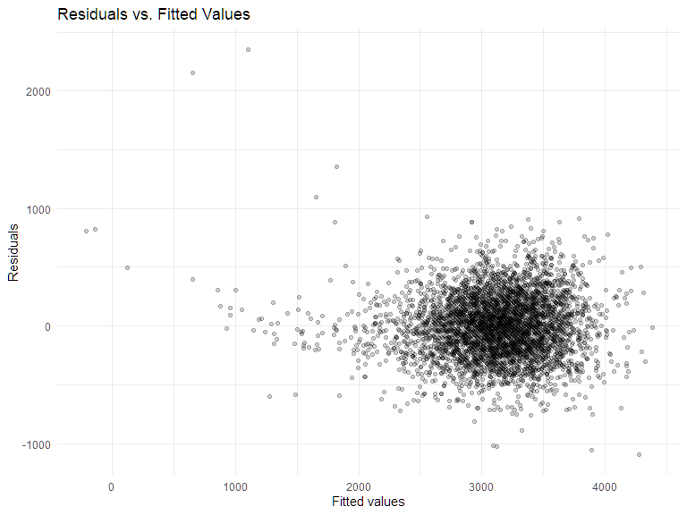

Homework 6
================
2022-12-1

## Problem 1

### Load dataset

``` r
weather_df = 
  rnoaa::meteo_pull_monitors(
    c("USW00094728"),
    var = c("PRCP", "TMIN", "TMAX"), 
    date_min = "2017-01-01",
    date_max = "2017-12-31") %>%
  mutate(
    name = recode(id, USW00094728 = "CentralPark_NY"),
    tmin = tmin / 10,
    tmax = tmax / 10) %>%
  select(name, id, everything())
```

    ## Registered S3 method overwritten by 'hoardr':
    ##   method           from
    ##   print.cache_info httr

    ## using cached file: C:\Users\LENOVO\AppData\Local/Cache/R/noaa_ghcnd/USW00094728.dly

    ## date created (size, mb): 2022-09-27 16:53:18 (8.418)

    ## file min/max dates: 1869-01-01 / 2022-09-30

### Bootstrap for r square and log value

``` r
boot_straps = 
  weather_df %>%
  bootstrap(n = 100, id = "strap_num") %>% 
  mutate(
    models = map(.x = strap, ~lm(tmax ~ tmin, data = .x)),
    results_r = map(models, broom::glance),
    results_log = map(models, broom::tidy)
  ) %>% 
  unnest(results_r,results_log) %>% 
  select(strap_num, term, estimate, r.squared) %>% 
  pivot_wider(
    names_from = term,
    values_from = estimate) %>% 
  rename(
    beta_0 = "(Intercept)",
    beta_1 = "tmin"
  ) %>% 
  mutate(
    log_beta = log(beta_0*beta_1)
  ) %>% 
  select(strap_num, r.squared, log_beta)
```

### Distribution of r square

``` r
boot_straps %>% 
  ggplot(aes(x = r.squared)) +
  geom_density() +
  labs(
    title = "Distribution of r squared estimates",
    x = "r squared estimate"
  )
```


**Description of r squared estimates**

This distribution of r squared estimates appears to follow a normal
distribution, centered around 0.905.

### Distribution of log beta product

``` r
boot_straps %>% 
  ggplot(aes(x = log_beta)) +
  geom_density() +
  labs(
    title = "Distribution of log(beta0*beta1) estimates",
    x = "log(beta0*beta1)"
  )
```


**Description of log beta product**

This distribution of log beta product appears to follow a normal
distribution, centered around 2.02.

### 95% Confidence interval for r squared

``` r
boot_straps %>% 
  summarize(
    ci_lower = quantile(r.squared, 0.025),
    ci_upper = quantile(r.squared, 0.975)
  )
```

    ## # A tibble: 1 × 2
    ##   ci_lower ci_upper
    ##      <dbl>    <dbl>
    ## 1    0.896    0.926

### 95% Confidence interval for log beta product

``` r
boot_straps %>% 
  summarize(
    ci_lower = quantile(log_beta, 0.025),
    ci_upper = quantile(log_beta, 0.975)
  )
```

    ## # A tibble: 1 × 2
    ##   ci_lower ci_upper
    ##      <dbl>    <dbl>
    ## 1     1.96     2.06

## Problem 2

### Load homicide dataset

``` r
homi_data = read_csv("./data/homicide-data.csv", show_col_types = FALSE)
```

### Create `city_state` and `resolved` variables

``` r
homi_df =
  homi_data %>% 
  mutate(
    city_state = str_c(city, state, sep = ", "),
    resolved = case_when(
      disposition == "Closed without arrest" ~ 0,
      disposition == "Open/No arrest"        ~ 0,
      disposition == "Closed by arrest"      ~ 1)
  ) %>% 
  filter((city_state != "Tulsa, AL"),
         (city_state != "Phoenix, AZ"),
         (city_state != "Kansas City, MO"),
         (city_state != "Dallas, TX"),
         (victim_race %in% c("White", "Black"))) %>% 
  mutate(
    victim_age = as.numeric(victim_age),
    victim_race = fct_relevel(victim_race, "White")
  ) %>% 
  select(city_state, resolved, victim_age, victim_race, victim_sex)
```

### Logistic regression for Baltimore

``` r
baltimore_df =
  homi_df %>% 
  filter(city_state == "Baltimore, MD")

baltimore_logis =
  baltimore_df %>% 
  glm(resolved ~ victim_age + victim_race + victim_sex, data = ., family = binomial()) 

baltimore_logis %>% 
  broom::tidy() %>% 
  mutate(
    OR = exp(estimate),
    CI_lower = exp(estimate - 1.96 * std.error),
    CI_upper = exp(estimate + 1.96 * std.error)
    ) %>%
  select(term, OR, starts_with("CI")) %>%
  filter(term == "victim_sexMale") %>% 
  knitr::kable(digits = 3)
```

| term           |    OR | CI_lower | CI_upper |
|:---------------|------:|---------:|---------:|
| victim_sexMale | 0.426 |    0.325 |    0.558 |

**Description of odds ratio for victim sex**

The adjusted odds ratio for solving homicides comparing male victims to
female victims is 0.426, with a 95% confidence interval of
(0.325,0.558), keeping all other variables fixed. This indicates that
the odds of resolved homicides for male victim is 0.426 times the odds
of resolved homicides for female victim, adjusting for victim age and
victim race. Homicides in which the victim is male are significantly
less like to be resolved than those in which the victim is female.

### Logistic regression for each city

``` r
cities_logis_df =
  homi_df %>%
  nest(data = -city_state) %>% 
  mutate(
    models = map(.x = data, ~glm(resolved ~ victim_age + victim_race + victim_sex, data = .x, family = binomial())),
    results = map(models, broom::tidy)) %>% 
  select(-data, -models) %>% 
  unnest(results) %>% 
  mutate(
    OR = exp(estimate),
    CI_lower = exp(estimate - 1.96 * std.error),
    CI_upper = exp(estimate + 1.96 * std.error)
    ) %>%
  select(city_state, term, OR, starts_with("CI")) %>%
  filter(term == "victim_sexMale") 
  
cities_logis_df %>% 
knitr::kable(digits = 3)
```

| city_state         | term           |    OR | CI_lower | CI_upper |
|:-------------------|:---------------|------:|---------:|---------:|
| Albuquerque, NM    | victim_sexMale | 1.767 |    0.831 |    3.761 |
| Atlanta, GA        | victim_sexMale | 1.000 |    0.684 |    1.463 |
| Baltimore, MD      | victim_sexMale | 0.426 |    0.325 |    0.558 |
| Baton Rouge, LA    | victim_sexMale | 0.381 |    0.209 |    0.695 |
| Birmingham, AL     | victim_sexMale | 0.870 |    0.574 |    1.318 |
| Boston, MA         | victim_sexMale | 0.674 |    0.356 |    1.276 |
| Buffalo, NY        | victim_sexMale | 0.521 |    0.290 |    0.935 |
| Charlotte, NC      | victim_sexMale | 0.884 |    0.557 |    1.403 |
| Chicago, IL        | victim_sexMale | 0.410 |    0.336 |    0.501 |
| Cincinnati, OH     | victim_sexMale | 0.400 |    0.236 |    0.677 |
| Columbus, OH       | victim_sexMale | 0.532 |    0.378 |    0.750 |
| Denver, CO         | victim_sexMale | 0.479 |    0.236 |    0.971 |
| Detroit, MI        | victim_sexMale | 0.582 |    0.462 |    0.734 |
| Durham, NC         | victim_sexMale | 0.812 |    0.392 |    1.683 |
| Fort Worth, TX     | victim_sexMale | 0.669 |    0.397 |    1.127 |
| Fresno, CA         | victim_sexMale | 1.335 |    0.580 |    3.071 |
| Houston, TX        | victim_sexMale | 0.711 |    0.558 |    0.907 |
| Indianapolis, IN   | victim_sexMale | 0.919 |    0.679 |    1.242 |
| Jacksonville, FL   | victim_sexMale | 0.720 |    0.537 |    0.966 |
| Las Vegas, NV      | victim_sexMale | 0.837 |    0.608 |    1.154 |
| Long Beach, CA     | victim_sexMale | 0.410 |    0.156 |    1.082 |
| Los Angeles, CA    | victim_sexMale | 0.662 |    0.458 |    0.956 |
| Louisville, KY     | victim_sexMale | 0.491 |    0.305 |    0.790 |
| Memphis, TN        | victim_sexMale | 0.723 |    0.529 |    0.988 |
| Miami, FL          | victim_sexMale | 0.515 |    0.304 |    0.872 |
| Milwaukee, wI      | victim_sexMale | 0.727 |    0.499 |    1.060 |
| Minneapolis, MN    | victim_sexMale | 0.947 |    0.478 |    1.875 |
| Nashville, TN      | victim_sexMale | 1.034 |    0.685 |    1.562 |
| New Orleans, LA    | victim_sexMale | 0.585 |    0.422 |    0.811 |
| New York, NY       | victim_sexMale | 0.262 |    0.138 |    0.499 |
| Oakland, CA        | victim_sexMale | 0.563 |    0.365 |    0.868 |
| Oklahoma City, OK  | victim_sexMale | 0.974 |    0.624 |    1.520 |
| Omaha, NE          | victim_sexMale | 0.382 |    0.203 |    0.721 |
| Philadelphia, PA   | victim_sexMale | 0.496 |    0.378 |    0.652 |
| Pittsburgh, PA     | victim_sexMale | 0.431 |    0.265 |    0.700 |
| Richmond, VA       | victim_sexMale | 1.006 |    0.498 |    2.033 |
| San Antonio, TX    | victim_sexMale | 0.705 |    0.398 |    1.249 |
| Sacramento, CA     | victim_sexMale | 0.669 |    0.335 |    1.337 |
| Savannah, GA       | victim_sexMale | 0.867 |    0.422 |    1.780 |
| San Bernardino, CA | victim_sexMale | 0.500 |    0.171 |    1.462 |
| San Diego, CA      | victim_sexMale | 0.413 |    0.200 |    0.855 |
| San Francisco, CA  | victim_sexMale | 0.608 |    0.317 |    1.165 |
| St. Louis, MO      | victim_sexMale | 0.703 |    0.530 |    0.932 |
| Stockton, CA       | victim_sexMale | 1.352 |    0.621 |    2.942 |
| Tampa, FL          | victim_sexMale | 0.808 |    0.348 |    1.876 |
| Tulsa, OK          | victim_sexMale | 0.976 |    0.614 |    1.552 |
| Washington, DC     | victim_sexMale | 0.690 |    0.468 |    1.017 |

### Create a plot for OR and 95% CI for each city

``` r
cities_logis_df %>%
  mutate(city_state = fct_reorder(city_state, OR)) %>%
  ggplot(aes(x = city_state, y = OR)) +
  geom_point() +
  geom_errorbar(aes(ymin = CI_lower, ymax = CI_upper)) + 
  theme(axis.text.x = element_text(angle = 90, hjust = 1)) +
  labs(
    x = "City, State",
    y = "Estimated Odds Ratios\n(95% CI)",
    title = "ORs for Solved Homicides Comparing Male to Female with 95% CIs for Each City"
  )
```


**Comment on the plot**

Most of the cities have estimated OR less than 1, indicating homicides
in which the victim is male are less like to be resolved than those in
which the victim is female. Among all cities, New York, NY has the
lowest estimated adjusted OR with a relatively narrow 95% CI, but
Albuquerque, NM has the highest estimated adjusted OR with a relatively
broad 95% CI.

## Problem 3

### Load and clean birthweigth dataset

``` r
birthweight_df =
  read_csv("./data/birthweight.csv", show_col_types = FALSE) %>% 
  mutate(
    babysex = as.factor(babysex),
    frace = as.factor(frace),
    malform = as.factor(malform),
    mrace = as.factor(mrace)) 

sum(is.na(birthweight_df))
```

    ## [1] 0

**Description of dataset**

The`birthweight` dataset contains 4342 observations and 20 variables.
There is no missing values.

### Fit my model using backward stepwise selection

``` r
full_model =
  lm(bwt ~., data = birthweight_df)

step_model =
  MASS::stepAIC(full_model, direction = "backward", trace = FALSE)
summary(step_model)
```

    ## 
    ## Call:
    ## lm(formula = bwt ~ babysex + bhead + blength + delwt + fincome + 
    ##     gaweeks + mheight + mrace + parity + ppwt + smoken, data = birthweight_df)
    ## 
    ## Residuals:
    ##      Min       1Q   Median       3Q      Max 
    ## -1097.18  -185.52    -3.39   174.14  2353.44 
    ## 
    ## Coefficients:
    ##               Estimate Std. Error t value Pr(>|t|)    
    ## (Intercept) -6098.8219   137.5463 -44.340  < 2e-16 ***
    ## babysex2       28.5580     8.4549   3.378 0.000737 ***
    ## bhead         130.7770     3.4466  37.944  < 2e-16 ***
    ## blength        74.9471     2.0190  37.120  < 2e-16 ***
    ## delwt           4.1067     0.3921  10.475  < 2e-16 ***
    ## fincome         0.3180     0.1747   1.820 0.068844 .  
    ## gaweeks        11.5925     1.4621   7.929 2.79e-15 ***
    ## mheight         6.5940     1.7849   3.694 0.000223 ***
    ## mrace2       -138.7925     9.9071 -14.009  < 2e-16 ***
    ## mrace3        -74.8868    42.3146  -1.770 0.076837 .  
    ## mrace4       -100.6781    19.3247  -5.210 1.98e-07 ***
    ## parity         96.3047    40.3362   2.388 0.017004 *  
    ## ppwt           -2.6756     0.4274  -6.261 4.20e-10 ***
    ## smoken         -4.8434     0.5856  -8.271  < 2e-16 ***
    ## ---
    ## Signif. codes:  0 '***' 0.001 '**' 0.01 '*' 0.05 '.' 0.1 ' ' 1
    ## 
    ## Residual standard error: 272.3 on 4328 degrees of freedom
    ## Multiple R-squared:  0.7181, Adjusted R-squared:  0.7173 
    ## F-statistic: 848.1 on 13 and 4328 DF,  p-value: < 2.2e-16

**Description of modeling process**

My proposed model starts with all predictors in the model (full_model),
and then perform the stepwise regression to choose the best model by
AIC. It return my final model (step_model). The final model `step_model`
includes 11 predictors, `babysex`, `bhead`, `blength`, `delwt`,
`fincome`, `gaweeks`, `mheight`, `mrace`, `parity`, `ppwt`, `smoken`.

### Make a plot of model residuals against fitted values

``` r
birthweight_df %>% 
  add_predictions(step_model) %>% 
  add_residuals(step_model) %>% 
  ggplot(aes(x = pred, y = resid)) +
  geom_point(alpha = 0.2) +
  labs(
    title = "Residuals vs. Fitted Values", 
    x = "Fitted values", 
    y = "Residuals")
```



### Compare my model with two others

``` r
cv_df = 
  crossv_mc(birthweight_df, 100) %>%
  mutate(
    train = map(train, as_tibble),
    test = map(test, as_tibble)
    )

cv_df =
  cv_df %>% 
  mutate(
    step_model = map(.x = train, ~lm(bwt ~ babysex + bhead + blength + delwt + fincome + gaweeks + mheight + mrace + parity + ppwt + smoken, data = .x)),
    main_model = map(.x = train, ~lm(bwt ~ gaweeks + blength, data = .x)),
    inter_model = map(.x = train, ~lm(bwt ~ bhead + blength + babysex + bhead * blength + bhead * babysex + blength * babysex + bhead * blength * babysex, data = .x))
    ) %>% 
  mutate(
    rmse_step_model = map2_dbl(.x = step_model, .y = test, ~rmse(model = .x, data = .y)),
    rmse_main_model = map2_dbl(.x = main_model, .y = test, ~rmse(model = .x, data = .y)),
    rmse_inter_model = map2_dbl(.x = inter_model, .y = test, ~rmse(model = .x, data = .y))
    )
```
